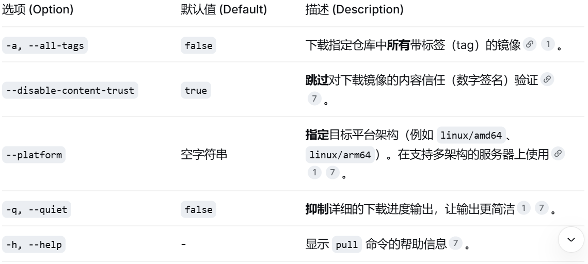
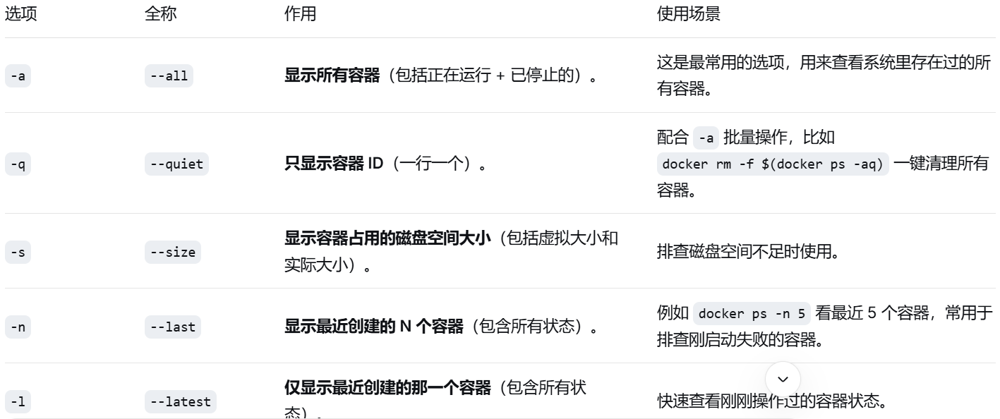
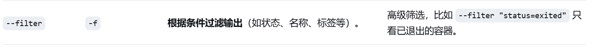
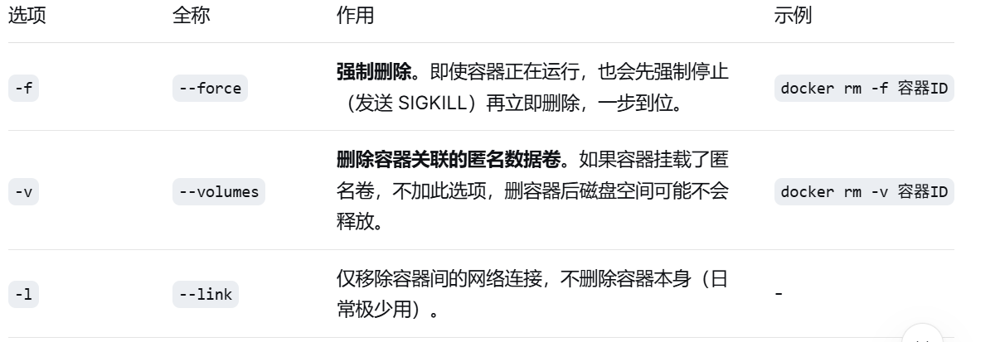

# Docker

## 1. docker pull 拉取镜像


```shell
docker pull [OPTIONS] NAME[:TAG|@DIGEST]
```

[OPTIONS]（选项）：用来调整下载行为的参数，不填则使用默认值。

NAME（镜像名称）：必填。镜像的名字，通常包含仓库地址和路径。

[:TAG]（标签）：指定版本号，如 1.26、alpine。不填则默认拉取 latest（最新版）。

[@DIGEST]（摘要）：指定镜像的精确哈希值（如 sha256:xxx）。优先级高于 TAG，用于确保每次拉取的内容绝对一致（不可变）。



## 2. 运行容器

```shell
docker run [OPTIONS] IMAGE [COMMAND] [ARG...]
```
- docker：调用 Docker 客户端程序。

- run：子命令，表示“创建并启动一个全新的容器”。

- -d（即 --detach）：后台运行模式。加了它，容器启动后会在后台默默运行，终端不会卡住，只返回一个容器 ID。如果不加，容器会“前台”运行，你一按 Ctrl+C 容器就停了。

- -p 8080:80（即 --publish）：端口映射。格式固定为 宿主机端口:容器内端口。意思是：把宿主机（你的电脑）的 8080 端口，映射到容器内部的 80 端口。因为 Nginx 容器默认监听 80 端口，所以这样配置后，你在浏览器访问 http://localhost:8080，就等于访问了容器里的 Nginx 服务。

- nginx：镜像名称。告诉 Docker 使用哪个镜像来创建容器（这里用的是你之前 docker pull 下来的 nginx 镜像）。

## 3. 查看容器

```shell
docker ps [OPTIONS]
```



## 4. 停止/删除容器

```shell
docker stop [OPTIONS] CONTAINER [CONTAINER...]
docker rm   [OPTIONS] CONTAINER [CONTAINER...]
```
其中 CONTAINER 可以是容器的 ID（短哈希）或 NAME（容器名称）。



- docker stop：优雅退出（给程序收拾残局的机会，比如保存数据库连接）。

- docker kill：暴力杀进程（直接断电，绝不等待，相当于拔电源线）。